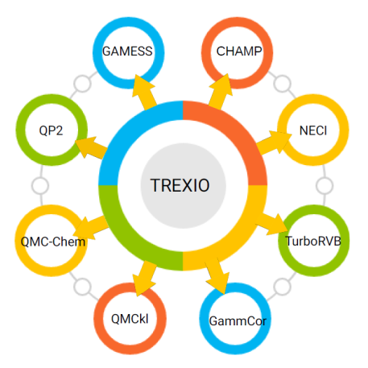

[](https://github.com/filippi-claudia/champ/actions/workflows/self_hosted_build_champ.yml) [](https://github.com/filippi-claudia/champ/actions/workflows/build_champ_debug.yml) [](https://github.com/filippi-claudia/champ/actions/workflows/champ_unit_test.yml) [](https://github.com/filippi-claudia/champ/actions/workflows/test_python.yml)


   [](https://img.shields.io/github/commit-activity/t/filippi-claudia/champ
)

    


The Cornell-Holland Ab-initio Materials Package (CHAMP) is a quantum Monte Carlo suite of programs for electronic structure calculations of atomic and molecular systems. The code is a sister code of the homonymous program originally developed by Cyrus Umrigar and Claudia Filippi of which it retains the accelerated Metropolis method and the efficient diffusion Monte Carlo algorithms.

The European branch of the code is currently developed by Claudia Filippi and Saverio Moroni,
with significant contributions by Ravindra Shinde, Nicolas Renaud, Victor Azizi, Edgar Landinez, and Stuart Shepard.


<!-- <a href = "https://github.com/filippi-claudia/champ/graphs/contributors">
  
</a> -->


CHAMP has three basic capabilities:

* Metropolis or variational Monte Carlo (VMC)
* Diffusion Monte Carlo (DMC)
* Optimization of many-body wave functions by energy minimization (VMC) for ground and excited states

Noteworthy features of CHAMP are:

* Efficient wave function optimization also in a state-average and a state-specific fashion for multiple states of the same symmetry (VMC)
* Efficient computation of analytical interatomic forces (VMC)
* Compact formulation for a fast evaluation of multi-determinant expansions and their derivatives (VMC and DMC)
* Multiscale VMC and DMC calculations in classical point charges (MM), polarizable continuum model (PCM), and polarizable force fields (MMpol)

**Note**

The code is available for free under the GPL-3.0 license. Developers and contributors are welcome to use and contribute back to the code. If you have used the code for your publications, please cite this source.

**Usual disclaimer**

The authors make no claims about the correctness of the program suite and people who use it do so at their own risk.

------------------------------------------------------------------------

CHAMP utilizes various other program packages:

1. [Parser](https://github.com/neelravi/mpi-libfdf-parser):
   An easy-to-use and easy-to-extend keyword-value pair based input file parser written in Fortran 2008.  This parser uses a heavily modified libFDF library and is written by [Ravindra Shinde](https://github.com/neelravi). It can parse keyword-value pairs, blocks of data, and general variables with different physical units in an order-independent manner. Our implementation can handle multiple data types and file formats. The parser is kept as a library in the code, however, it can be easily adapted by any other Fortran-based code.

2. [TREXIO](https://github.com/TREX-CoE/trexio):
   TREXIO is an open-source file format and library developed for the storage and manipulation of data produced by quantum chemistry calculations. CHAMP can read the starting wavefunction from a trexio file. The library has interfaces to a lot of quantum chemical programs.
   CHAMP can directly read the contents of this file with a single load statement in the input file. This library is currently optional.

  <p align="center">
    
  </p>


3. [TREXIO Tools](https://github.com/TREX-CoE/trexio_tools):
   We provide a python package inside the CHAMP's tool directory to extract all the necessary information from a TREXIO file in the hdf5 file format to a human-readable text format. This allows one to bypass the use of the TREXIO library within CHAMP and input the necessary data via the Parser (see Option 2 in Section "Preparing the Input File" below).

4. [QMCKL](https://github.com/TREX-CoE/qmckl):
  This library provides a high-performance implementation of the main kernels of Quantum Monte Carlo methods. This library is currently optional.


------------------------------------------------------------------------

### Requirements
1. cmake >= 3.17
2. gfortran/gcc >= 9.3.0 or Intel Fortran 2020 onwards
3. BLAS/LAPACK or Intel MKL
4. openMPI >= 3.0 or Intel MPI
5. [Optional] TREXIO library >= 2.3.0
6. [Optional] QMCkl library >= 0.2.1
7. [Optional] doxygen (for documentation)


### Installation Using CMake
To install **Champ** using [cmake](https://cmake.org/) you need to run the following commands:
```
cmake -H. -Bbuild
cmake --build build -- -j4
```
The first command is only required to set up the build directory and needs to be
executed only once. Compared to the previous Makefiles the dependencies for the
include files (e.g include/vmc.h) are correctly setup and no `--clean-first` is
required.

#### CMAKE Options

To select a given compiler, you can type:
```
cmake -H. -Bbuild -D CMAKE_Fortran_COMPILER=mpif90
```
To use LAPACK and BLAS installed locally, include the path to the libraries:
```
cmake -H. -Bbuild -D CMAKE_Fortran_COMPILER=mpif90 -D BLAS_blas_LIBRARY=/home/user/lib/BLAS/blas_LINUX.a -D LAPACK_lapack_LIBRARY=/home/user/lib/LAPACK/liblapack.a
```
To enable/disable vectorization based on the architecture:
```bash
cmake -H. -Bbuild -DCMAKE_Fortran_COMPILER=mpif90 -DVECTORIZED=yes/no/auto
```

To compile only e.g. VMC serial:
```
cmake --build build --target vmc.mov1
```
Clean and build:
```
cmake --build build --clean-first
```
Compared to the previous Makefiles the dependencies for the include files
(e.g include/vmc.h) are correctly setup and no `--clean-first` is required. ##

#### CMAKE Recipes

Here are a couple of recipes for commonly used computing facilities, which can be easily adapted.
* **Snellius** (snellius.surfa.nl):
	- To compile the code, first load the required modules:
		```bash
		module purge
		module load 2022
		module load intel/2022a               
		module load HDF5/1.12.2-iimpi-2022a
		```
		then set-up the build:
		```bash
		cmake -H. -Bbuild -DCMAKE_Fortran_COMPILER=mpiifort
		```
		Optionally, you may link the trexio library using the following command:
		```bash
		cmake -S. -Bbuild -DCMAKE_Fortran_COMPILER=mpiifort -DENABLE_TREXIO=ON -DTREXIO_LIBRARY=$HOME/lib/libtrexio.so -DTREXIO_INCLUDE_DIR=$HOME/include/
		```
		and finally build:
		```bash
		cmake --build build -j8 --clean-first
		```
	- To run the code, you need to submit a job to the queue system:
		```bash
		sbatch job.cmd
		```
		where `job.cmd` is a SLURM script for `genoa` partition that looks like this:

		```bash
		#!/bin/bash
        #SBATCH -t 0-12:00:00            # time in (day-hours:min:sec)
        #SBATCH -N 1                     # number of nodes (change this number to use more nodes)
        #SBATCH --ntasks-per-node 192    # tasks per node (Use 192 for genoa and 128 for rome partition)
        #SBATCH -J vmc                   # name of the job
        #SBATCH -o vmc.%j.out            # std output file name for slurm
        #SBATCH -e vmc.%j.err            # std error file name for slurm
        #SBATCH --exclusive              # specific requirements about node
        #SBATCH --partition genoa        # partition (queue)
        #
        module purge
        module load 2022
        module load intel/2022a
        module load HDF5/1.12.2-iimpi-2022a
        #
        export I_MPI_PMI_LIBRARY=/usr/lib64/libpmi2.so
        cd $PWD
		srun champ/bin/vmc.mov1 -i input.inp -o output.out -e error
		```
* **CCPGate**:
	- To build with mpiifort, load the required modules of the Intel Compiler and MPI:

		```bash
        module load compiler
        module load compiler-rt
        module load mkl
        module load mpi
        module load trexio/2.3.0-intel     # Optional
        module load python3                # Optional
		```
		Setup the build:
		```
		cmake -H. -Bbuild -DCMAKE_Fortran_COMPILER=mpiifort
		```
	- To enable TREXIO library:
		```
		cmake -H. -Bbuild -DCMAKE_Fortran_COMPILER=mpiifort -DENABLE_TREXIO=ON
		```
	- To disable vectorization of the code:
		```
		cmake -H. -Bbuild -DCMAKE_Fortran_COMPILER=mpiifort -DVECTORIZED=no
		```

	- To run the code with Intel Compilers and MPI:
	    ```bash
        mpirun -np 24  champ/bin/vmc.mov1 -i input.inp -o output.out -e error
		```

 	- To build with gfortran:

		Setup the build:
		```
		cmake -H. -Bbuild -DCMAKE_Fortran_COMPILER=/usr/bin/mpif90
		```
		which will use LAPACK & BLAS from the Ubuntu repository. (Cmake should find them already if none of the Intel MKL variables are set.) Combining gfortran with the Intel MKL is possible but requires special care to work with the compiler flag `-mcmodel=large`.
	- To run the code:
		```
		mpirun -s all -np "n process" -machinefile "machinefile"
		```
* **Ubuntu desktop**:
	- Ubuntu 20:
		Install the required packages:
		```
		sudo apt install gfortran openmpi-bin libopenmpi-dev gawk libblacs-mpi-dev liblapack-dev
		```
		Set-up the build:
		```
		cmake -H. -Bbuild -DCMAKE_Fortran_COMPILER=mpifort
		```
		Build:
		```
		cmake --build build -- -j2
		```
		To run in parallel:
		```
		mpirun --stdin all -n 2 path_to_CHAMP/bin/vmc.mov1 < vmc.inp > vmc.out
		```
	- Ubuntu 18:
	Install the dependencies using conda instead of apt
	- WSL:
	The code also compiles on WSL.
------------------------------------------------------------------------

## User's manual and documentation
The user's manual and documentation is hosted at [https://trex-coe.github.io/champ-user-manual/](https://trex-coe.github.io/champ-user-manual)


# Preparing the input files

CHAMP needs following input files to describe a system
1. Geometry
1. ECP / Pseudopotentials
1. Basis Set (Radial Grid files)
1. Basis pointers
1. MO coefficients
1. Determinants and/or CSF files
1. Molecular orbital symmetries (Optional)
1. Molecular orbital eigenvalues (Optional)
1. Jastrow parameters file
1. Jastrow derivative parameters file (Optional)


CHAMP input file itself has a modular structure. For example,

```
1. general
2. electrons
3. blocking_vmc
4. blocking_dmc
5. optwf
6. ...
```


## Option 1 (Using trexio file)

We can use trexio file (in hdf5 or text backend format) to specify all the inputs (except Jastrow and Jastrow derivatives)

A sample input file would look like:

```perl
%module general
    title           'VMC Calculation for a molecule'
    pool            './pool/'
    mode            'vmc'
    seed            1138139413245321
    ipr -1
%endmodule

load trexio          molecule.hdf5
load determinants    determinants.det
load jastrow         jastrow.jas

%module electrons
    nup           20
    nelec         40
%endmodule


%module blocking_vmc
    vmc_nstep     20
    vmc_nblk      100000
    vmc_nblkeq    1
    vmc_nconf_new 0
%endmodule
```

### Obtaining a trexio file from GAMESS-US output

Make sure that the recent version of `trexio_tools` has been installed.
```bash
pip install trexio_tools
```

This will provide `trexio` executable in the path. Use the following command to generate a trexio file.

```bash
trexio convert-from --type gamess --input gamess_output.out --motype "RHF" victor.hdf5 --back_end=HDF5
```
Allowed values of MOtype are `'RHF', 'ROHF', 'MCSCF', 'NATURAL', 'GUGA' ...`

> **NOTE** : Use `trexio --help` for a verbose list of options.

## Option 2 (Specification using individual text files)

The trexio file can be converted into several text files to be used with CHAMP. The python converter is provided in the CHAMP's repository in the `champ/tools/trex_tools` folder.

A sample script is given below:

```python
python3 /home/user/champ/tools/trex_tools/trex2champ.py \
	--trex 	"COH2_GS.trexio" \
	--backend	"HDF5" \
	--basis_prefix  "BFD-aug-cc-pVDZ" \
	--lcao \
	--ecp \
	--sym \
	--geom \
	--basis \
	--det
```


> **NOTE** : Use `python3 trex2champ.py --help` for a verbose list of options.

## Molecular coordinates

Molecular coordinates can be provided directly in the vmc or dmc input files using the `%block` structure of the parser.

The following are the valid examples

1. ### Geometry in the (XYZ in Bohr units) format with automatic Zvalence
```perl
%block molecule
10
# molecular complex (Symbol, X,Y,Z in Bohr)
  Si  -0.59659972  0.06162019  0.21100680
  S   -2.60025162 -2.54807062 -2.52884266
  S    2.14594449  2.17606672 -2.44253887
  S    1.75703132 -2.78062975  2.53564756
  S   -1.40663455  3.06742023  3.14712509
  H   -3.50597461  0.49044059  0.39864337
  H    0.96753971  3.57914102  3.86259992
  H   -0.57825615 -3.70197321 -3.52433897
  H    0.37416575  3.66039924 -3.47898554
  H   -0.21164931 -3.70953211  3.82669513
%endblock
```

2. ### Geometry in the (XYZ in Bohr units) format with explicit Zvalence. This also allows different labels for the same element.
```perl
%block molecule
10
# molecular complex (Symbol, X,Y,Z in Bohr, Zvalence)
  Si   -0.59659972  0.06162019  0.21100680    4.0
  S    -2.60025162 -2.54807062 -2.52884266    6.0
  S     2.14594449  2.17606672 -2.44253887    6.0
  S     1.75703132 -2.78062975  2.53564756    6.0
  S    -1.40663455  3.06742023  3.14712509    6.0
  H1   -3.50597461  0.49044059  0.39864337    1.0
  H2    0.96753971  3.57914102  3.86259992    1.0
  H2   -0.57825615 -3.70197321 -3.52433897    1.0
  H2    0.37416575  3.66039924 -3.47898554    1.0
  H2   -0.21164931 -3.70953211  3.82669513    1.0
%endblock
```

3. ### Geometry in the (XYZ in Bohr units) format to be read from a separate .xyz file.

` %block molecule < molecule.xyz `

4. ### Geometry in the (XYZ in Bohr units) format to be read from a separate .xyz file.

` load molecule  molecule.xyz `


## ECP / Pseudopotential files

ECP or pseudopotential files have a fixed format. Most of the BFD ECP files can be found in the `champ/pool/BFD/ECP_champ` folder. The files generated from the trexio file can also be used (except if it is coming from GAMESS. In this case, GAMESS truncates the digits of ECP information in its output, so the trexio file will not have all the digits stored.)

File format: BFD ECP for Silicon

`BFD.gauss_ecp.dat.Si`

```perl
BFD Si pseudo
3
3
4.00000000 1 1.80721061
7.22884246 3 9.99633089
-13.06725590 2 2.50043232
1
21.20531613 2 2.26686403
1
15.43693603 2 2.11659661
```
These files are generally kept in the `pool` directory of the calculation folder. You just need to specify the the name `BFD` in the general module of CHAMP input file under the keyword `pseudopot`. There should be a file for each type of an atom.

```python
%module general
    title           'VMC Calculation for a molecule'
    pool            './pool/'
    mode            'vmc'
    seed            1138139413245321
    pseudopot       BFD
    basis           ccpVTZ
    ipr             -1
%endmodule
```

## Basis set (Basis on the radial grid) files

Basis files have a fixed format. The files generated from the trex2champ converter can also be used as they are.
These files are generally kept in the `pool` directory of the calculation folder. You just need to specify the name of the basis file (say, `ccpVTZ`) in the general module of CHAMP input file under the keyword `basis`. This will read the file `ccpVTZ.basis.Si` for the element `Si`.

The top few lines of `BFD-T.basis.C` look like

```python
9 3 2000 1.003000 20.000000 0
 0.000000000000e+00  5.469976184517e-01  2.376319920758e+00  5.557936498748e-01  3.412818210005e+00  2.206803021951e-01  8.610719484857e-01  3.738901952004e-01  3.289926074834e+00  1.106692909826e+00
 1.508957441883e-04  5.469976454488e-01  2.376319870895e+00  5.557936481942e-01  3.412817957941e+00  2.206803015581e-01  8.610719410992e-01  3.738901923954e-01  3.289925989316e+00  1.106692890335e+00
 ...
 ```
This means there are 9 radial shells in the basis set of carbon put on a radial grid of 2000 points (upto 20 bohr).


## Basis pointers (formerly bfinfo) files

The new format of the basis pointers file is given below. This file should be kept in the `pool` directory.
This file is generated automatically by the `trex2champ.py` converter.

```python
# Format of the new basis information file champ_v3
# num_ao_per_center, n(s), n(p), n(d), n(f), n(g)
# Index of Slm (Range 1 to 35)
# Index of column from numerical basis file
qmc_bf_info 1
54 4 4 3 2 0
1 1 1 1 2 3 4 2 3 4 2 3 4 2 3 4 5 6 7 8 9 10 5 6 7 8 9 10 5 6 7 8 9 10 11 12 13 14 15 16 17 18 19 20 11 12 13 14 15 16 17 18 19 20
1 2 3 4 5 5 5 6 6 6 7 7 7 8 8 8 9 9 9 9 9 9 10 10 10 10 10 10 11 11 11 11 11 11 12 12 12 12 12 12 12 12 12 12 13 13 13 13 13 13 13 13 13 13
35 4 3 2 1 0
1 1 1 1 2 3 4 2 3 4 2 3 4 5 6 7 8 9 10 5 6 7 8 9 10 11 12 13 14 15 16 17 18 19 20
1 2 3 4 5 5 5 6 6 6 7 7 7 8 8 8 8 8 8 9 9 9 9 9 9 10 10 10 10 10 10 10 10 10 10
end
```

Each unique type of atom will have a pair of lines in the basis pointers file.

The first line after the comments `qmc_bf_info 1` is a specification line to make sure that we are reading basis function information file.

The second line is for the first unique atom in the system. It contains the number of atomic orbitals for that atom, the number of s-type functions, number of p-type functions, number of d-type functions, number of f-type functions, and number of g-type functions.
`num_ao_per_center, n(s), n(p), n(d), n(f), n(g)`

The third line gives the index of Slm (or real Ylm). The numbers depend on how many radial shells are there in the basis set.

The fourth line tells which column of the radial grid file to be read for the construction of MO from the AOs.


## Molecular Orbitals file

This file contains the molecular orbital coefficients. These are arranged as [num_ao, num_mo] array. This file is obtained automatically from the `trex2champ.py` converter. Please note that the AOs in this file follow the trexio convention of AO ordering.

For example,
Four p-type shells of AOs will be arranged alphabetically as

`X Y Z   X Y Z   X Y Z   X Y Z`

Two d-type shells of AOs will be arranged alphabetically as

`XX XY XZ YY YZ ZZ   XX XY XZ YY YZ ZZ`

and so on.

The `.lcao` or `.orb` file has the following format.

```python
lcao  226 200  1
...
...

end
```

The number 226 will be number of AOs, 200 will be number of orbitals, 1 will be number of types of orbitals.

## determinants and/or CSF file
The determinant file is automatically obtained from the `trex2champ.py` converter. Note that the `trex2champ.py` can also provide CSF and CSF map information if the corresponding GAMESS output file is provided with `--gamess` option.

The below is a typical file.

```python
# Determinants, CSF, and CSF mapping from the GAMESS output / TREXIO file.
# Converted from the trexio file using trex2champ converter https://github.com/TREX-CoE/trexio_tools
determinants 36 1
-0.92276500 0.08745570 0.08745570 -0.03455773 -0.03455773 0.15892000 -0.00958342 -0.00958342 0.03141700 0.06827967 0.06827967 -0.02315988 -0.02315988 0.01639443 -0.00751472 0.00887972 0.00887972 -0.00751472 0.01639443 0.14336029 0.14336029 -0.06358518 -0.06358518 -0.00177625 -0.00177625 -0.01588657 -0.01588657 0.16425900 0.02504927 0.02504927 0.11380000 0.00560594 0.00560594 0.01069429 0.01069429 -0.04482000
   1    2    3    4    5    6    7    8    9   10   11      1    2    3    4    5    6    7    8    9   10   11
   1    2    3    4    5    6    7    8    9   10   11      1    2    3    4    5    6    7    8    9   10   13
   1    2    3    4    5    6    7    8    9   10   13      1    2    3    4    5    6    7    8    9   10   11
   1    2    3    4    5    6    7    8    9   10   11      1    2    3    4    5    6    7    8    9   11   13
   1    2    3    4    5    6    7    8    9   11   13      1    2    3    4    5    6    7    8    9   10   11
   1    2    3    4    5    6    7    8    9   10   13      1    2    3    4    5    6    7    8    9   10   13
   1    2    3    4    5    6    7    8    9   10   13      1    2    3    4    5    6    7    8    9   11   13
   1    2    3    4    5    6    7    8    9   11   13      1    2    3    4    5    6    7    8    9   10   13
   1    2    3    4    5    6    7    8    9   11   13      1    2    3    4    5    6    7    8    9   11   13
   1    2    3    4    5    6    7    8    9   10   11      1    2    3    4    5    6    7    8    9   10   12
   1    2    3    4    5    6    7    8    9   10   12      1    2    3    4    5    6    7    8    9   10   11
   1    2    3    4    5    6    7    8    9   10   11      1    2    3    4    5    6    7    8    9   11   12
   1    2    3    4    5    6    7    8    9   11   12      1    2    3    4    5    6    7    8    9   10   11
   1    2    3    4    5    6    7    8    9   10   11      1    2    3    4    5    6    7    8    9   12   13
   1    2    3    4    5    6    7    8    9   10   13      1    2    3    4    5    6    7    8    9   11   12
   1    2    3    4    5    6    7    8    9   10   12      1    2    3    4    5    6    7    8    9   11   13
   1    2    3    4    5    6    7    8    9   11   13      1    2    3    4    5    6    7    8    9   10   12
   1    2    3    4    5    6    7    8    9   11   12      1    2    3    4    5    6    7    8    9   10   13
   1    2    3    4    5    6    7    8    9   12   13      1    2    3    4    5    6    7    8    9   10   11
   1    2    3    4    5    6    7    8    9   10   13      1    2    3    4    5    6    7    8    9   10   12
   1    2    3    4    5    6    7    8    9   10   12      1    2    3    4    5    6    7    8    9   10   13
   1    2    3    4    5    6    7    8    9   11   13      1    2    3    4    5    6    7    8    9   11   12
   1    2    3    4    5    6    7    8    9   11   12      1    2    3    4    5    6    7    8    9   11   13
   1    2    3    4    5    6    7    8    9   10   13      1    2    3    4    5    6    7    8    9   12   13
   1    2    3    4    5    6    7    8    9   12   13      1    2    3    4    5    6    7    8    9   10   13
   1    2    3    4    5    6    7    8    9   11   13      1    2    3    4    5    6    7    8    9   12   13
   1    2    3    4    5    6    7    8    9   12   13      1    2    3    4    5    6    7    8    9   11   13
   1    2    3    4    5    6    7    8    9   10   12      1    2    3    4    5    6    7    8    9   10   12
   1    2    3    4    5    6    7    8    9   10   12      1    2    3    4    5    6    7    8    9   11   12
   1    2    3    4    5    6    7    8    9   11   12      1    2    3    4    5    6    7    8    9   10   12
   1    2    3    4    5    6    7    8    9   11   12      1    2    3    4    5    6    7    8    9   11   12
   1    2    3    4    5    6    7    8    9   10   12      1    2    3    4    5    6    7    8    9   12   13
   1    2    3    4    5    6    7    8    9   12   13      1    2    3    4    5    6    7    8    9   10   12
   1    2    3    4    5    6    7    8    9   11   12      1    2    3    4    5    6    7    8    9   12   13
   1    2    3    4    5    6    7    8    9   12   13      1    2    3    4    5    6    7    8    9   11   12
   1    2    3    4    5    6    7    8    9   12   13      1    2    3    4    5    6    7    8    9   12   13
end
csf 20 2
0.92276500 -0.12368100 0.04887200 -0.15892000 0.01355300 -0.03141700 -0.09656200 0.03275300 0.02839600 -0.20274200 -0.00136500 0.08992300 -0.00251200 -0.02246700 -0.16425900 -0.03542500 -0.11380000 0.00792800 0.01512400 0.04482000
0.13390600 -0.08999000 -0.04327600 0.07929200 0.06217900 -0.00658100 0.96025800 -0.00444100 0.01898800 0.15434900 -0.04594200 -0.01868700 0.00187600 0.04520300 -0.06578900 -0.04536600 0.04834200 -0.00269300 -0.04316900 -0.02239200
end
csfmap
20 36 40
1
  1  -1.000000
2
  2  -0.707107
  3  -0.707107
2
  4  -0.707107
  5  -0.707107
1
  6  -1.000000
2
  7  -0.707107
  8  -0.707107
1
  9  -1.000000
2
  10  -0.707107
  11  -0.707107
2
  12  -0.707107
  13  -0.707107
6
  14  0.577350
  15  -0.288675
  16  0.288675
  17  0.288675
  18  -0.288675
  19  0.577350
2
  20  -0.707107
  21  -0.707107
4
  15  -0.500000
  16  -0.500000
  17  -0.500000
  18  -0.500000
2
  22  -0.707107
  23  -0.707107
2
  24  0.707107
  25  0.707107
2
  26  0.707107
  27  0.707107
1
  28  -1.000000
2
  29  -0.707107
  30  -0.707107
1
  31  -1.000000
2
  32  0.707107
  33  0.707107
2
  34  0.707107
  35  0.707107
1
  36  -1.000000
end
```

## Molecular orbital symmetries file [Optional; useful when doing orbital optimization]
This file is also generated using the `trex2champ.py` converter if the parent .hdf5 file contains the orbital symmetries.

A typical file looks like this:

```python
sym_labels 4 226
 1 AG 2 AU 3 BG 4 BU
1 4 4 1 1 4 1 4 1 2 3 2 3 4 1 4 1 4 4 1 1 4 4 1 4 1 3 1 4 1 2 4 1 2 4 1 3 2 4 3 2 1 4 4 3 1 1 4 4 4 2 1 3 1 4 1 1 4 1 4 3 1 4 2 2 3 1 4 1 4 1 1 4 2 3 4 1 4 2 1 3 1 4 1 4 2 4 4 1 3 4 1 3 4 2 1 2 3 4 1 2 4 1 3 4 2 3 1 1 4 4 1 2 1 3 1 4 1 4 2 3 4 1 4 2 1 4 3 1 4 2 3 2 3 4 1 2 3 1 2 4 2 3 4 1 4 3 2 1 1 3 4 4 1 4 1 2 4 1 3 1 2 4 4 4 3 1 1 3 1 1 2 2 4 4 2 1 4 3 1 1 4 3 4 2 1 1 2 4 3 4 3 2 1 3 4 1 3 1 4 4 2 1 4 1 4 1 1 4 4 4 1 1 1 4 1 4 4 1 4 1 4 1 4 1 4
end
```

The numbers in front of irreducible representations are used as correspondence to identify the symmetry type of each orbital. Here in this case there are 226 molecular orbitals with 4 irreps.

## Molecular orbital eigenvalues file [Optional]
This file is also generated using the `trex2champ.py` converter if the parent .hdf5 file contains the orbital eigenvalues.

A typical file looks like this:

```python
# File created using the trex2champ converter https://github.com/TREX-CoE/trexio_tools
# Eigenvalues correspond to the RHF orbitals
eigenvalues 64
-1.3659 -0.7150 -0.5814 -0.5081 0.1201 0.1798 0.4846 0.5148 0.5767 0.6085 0.7153 0.7820 0.8691 0.8699 0.9642 1.2029 1.4091 1.4388 1.6082 1.6342 2.0787 2.1179 2.1776 2.2739 2.4123 2.5591 2.8217 3.3480 3.3840 3.4544 3.4607 3.6199 3.6237 3.9628 3.9661 4.0439 4.0481 4.2212 4.3500 4.4225 4.4577 4.5747 4.7271 4.8382 5.0086 5.5800 5.8020 6.0317 6.3754 6.5827 6.6970 6.7474 6.9245 7.0790 7.1820 7.2121 7.3257 7.3865 7.8607 8.4146 8.4733 9.0201 16.4980 27.1462
end

```

The first line contains a keyword `eigenvalues` followed by the number of orbitals. The following line contains
 eigenvalues as they appear in GAMESS or similar output. The file ends with keyword `end`.

## Jastrow parameters file
The Jastrow parameters can be provided using this file. It has the following format [Example: water].

```python
jastrow_parameter   1
  5  5  0           norda,nordb,nordc
   0.60000000         scalek
   0.00000000   0.00000000  -0.41907755  -0.22916790  -0.04194614   0.08371252 (a(iparmj),iparmj=1,nparma)
   0.00000000   0.00000000  -0.09956809  -0.00598089   0.00503028   0.00600649 (a(iparmj),iparmj=1,nparma)
   0.50000000   0.36987319   0.06971895   0.00745636  -0.00306208  -0.00246314 (b(iparmj),iparmj=1,nparmb)
 (c(iparmj),iparmj=1,nparmc)
 (c(iparmj),iparmj=1,nparmc)
end
```

The set `a`should appear for each unique atom type (in the same order as in the .xyz file).

The set `b` should appear once.

The three-body Jastrow terms `c` should appear for each unique atom type (in the same order as in the .xyz file)


## Jastrow derivatives file
The Jastrow derivative parameters can be provided using this file. It has the following format [Example: water].

```python
jasderiv
4 4 5 15 15 0 0 nparma,nparmb,nparmc,nparmf
  3 4 5 6 (iwjasa(iparm),iparm=1,nparma)
  3 4 5 6 (iwjasa(iparm),iparm=1,nparma)
2 3 4 5 6 (iwjasb(iparm),iparm=1,nparmb)
3 5 7 8 9         11 13 14 15 16     17 18 20 21 23 (c(iparmj),iparmj=1,nparmc)
3 5 7 8 9         11 13 14 15 16     17 18 20 21 23 (c(iparmj),iparmj=1,nparmc)
end
```
