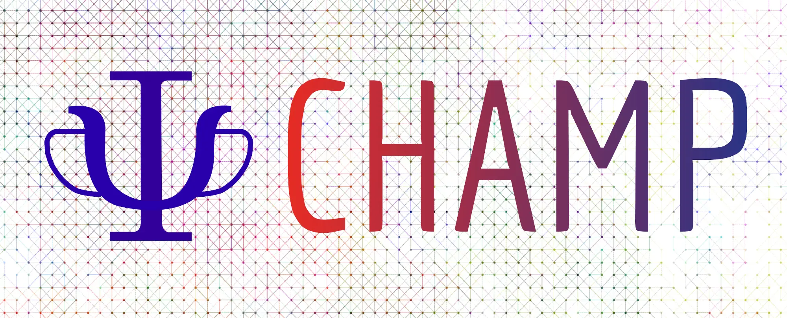

# Cornell-Holland Ab-initio Materials Package

<figure markdown="span">
  { width="300" }
</figure>

## Overview

The Cornell-Holland Ab-initio Materials Package (CHAMP-EU) is a quantum Monte Carlo suite of programs for electronic structure calculations of atomic and molecular systems. The code is a sister code of the homonymous program originally developed by Cyrus Umrigar and Claudia Filippi of which it retains the accelerated Metropolis method and the efficient diffusion Monte Carlo algorithms.

The European branch of the code is currently developed by Claudia Filippi and Saverio Moroni,
with significant contributions by Ravindra Shinde, Emiel Slootman, Nicolas Renaud, Victor Azizi, Edgar Landinez, and Stuart Shepard.

## Features

CHAMP has three basic capabilities:

* Metropolis or variational Monte Carlo (VMC)
* Diffusion Monte Carlo (DMC)
* Optimization of many-body wave functions by energy minimization (VMC) for ground and excited states

Noteworthy features of CHAMP are:

* Efficient wave function optimization also in a state-average and a state-specific fashion for multiple states of the same symmetry (VMC)
* Efficient computation of analytical interatomic forces (VMC)
* Compact formulation for a fast evaluation of multi-determinant expansions and their derivatives (VMC and DMC)
* Multiscale VMC and DMC calculations in classical point charges (MM), polarizable continuum model (PCM), and polarizable force fields (MMpol)

## Note

The code is available for free under the GPL-3.0 license. Developers and contributors are welcome to use and contribute back to the code. If you have used the code for your publications, please cite this source.

## Disclaimer

The authors make no claims about the correctness of the program suite and it is provided without warranty under GPL-3.0. 

